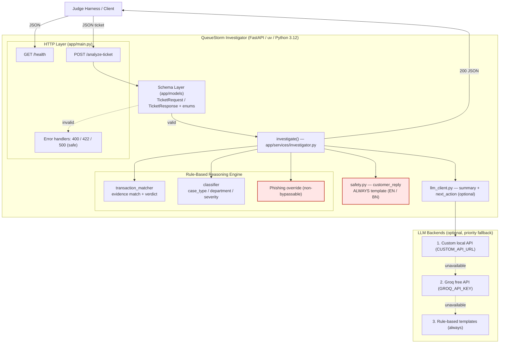

# QueueStorm Investigator

AI/API SupportOps service for digital finance ticket investigation.
Built for the **SUST CSE Carnival 2026 · Codex Community Hackathon** Online Preliminary Round.

---

## Endpoints

| Method | Path | Description |
|--------|------|-------------|
| GET | `/health` | Service readiness check |
| POST | `/analyze-ticket` | Investigate a support ticket |

---

## Architecture



The complaint is **investigated against the transaction history** (not just classified): the matcher picks the `relevant_transaction_id` and decides the `evidence_verdict`, the classifier routes and scores it, and the safety layer always produces `customer_reply` from templates so no LLM can introduce a safety violation. The optional LLM layer only polishes `agent_summary` and `recommended_next_action`, falling back through custom API → Groq → rule-based templates.

See [`docs/architecture.md`](./docs/architecture.md) for the full sequence diagram, LLM fallback decision flow, and design principles.

---

## Setup

**Requirements:** Python 3.12+, [uv](https://github.com/astral-sh/uv)

```bash
git clone <repo-url>
cd sust_csecarnival_26_main_prelim
uv sync
uv run uvicorn app.main:app --host 0.0.0.0 --port 8000 --reload
```

API docs available at `http://localhost:8000/docs`.

---

## Vercel Deployment

```bash
npm i -g vercel   # install Vercel CLI once
vercel            # follow prompts — deploys automatically
```

Set environment variables in the Vercel dashboard (Project → Settings → Environment Variables):
- `CUSTOM_API_URL`, `CUSTOM_API_KEY`, `CUSTOM_MODEL` (optional)
- `GROQ_API_KEY`, `GROQ_MODEL` (optional)

The `vercel.json` and `api/index.py` are already included. Vercel installs dependencies from `requirements.txt`.

After deploy, the live URL exposes:
```
GET  https://<your-app>.vercel.app/health
POST https://<your-app>.vercel.app/analyze-ticket
```

---

## Docker

```bash
# Build
docker build -t queuestorm-team .

# Run (judges' way — with env file)
docker run -p 8000:8000 --env-file judging.env queuestorm-team

# Run without env file (fully rule-based, no API key needed)
docker run -p 8000:8000 queuestorm-team
```

`/health` responds within 60 seconds of container start.
`POST /analyze-ticket` responds within 30 seconds (typically < 1 second rule-based).

---

## Sample Request / Response

See [`sample_output.json`](./sample_output.json) for a full worked example.

```bash
curl -X POST http://localhost:8000/analyze-ticket \
  -H "Content-Type: application/json" \
  -d '{
    "ticket_id": "TKT-001",
    "complaint": "I sent 5000 taka to a wrong number around 2pm today.",
    "language": "en",
    "transaction_history": [
      {
        "transaction_id": "TXN-9101",
        "timestamp": "2026-04-14T14:08:22Z",
        "type": "transfer",
        "amount": 5000,
        "counterparty": "+8801719876543",
        "status": "completed"
      }
    ]
  }'
```

Example response:
```json
{
  "ticket_id": "TKT-001",
  "relevant_transaction_id": "TXN-9101",
  "evidence_verdict": "consistent",
  "case_type": "wrong_transfer",
  "severity": "high",
  "department": "dispute_resolution",
  "agent_summary": "Customer reports sending 5000 BDT via TXN-9101 to an unintended recipient. Evidence is consistent.",
  "recommended_next_action": "Verify transaction TXN-9101 details with the customer and initiate the wrong-transfer dispute workflow per policy.",
  "customer_reply": "We have noted your concern about transaction TXN-9101. Our dispute team will review the case and contact you through official support channels. Please do not share your PIN or OTP with anyone.",
  "human_review_required": true,
  "confidence": 0.9,
  "reason_codes": ["wrong_transfer", "transaction_match", "evidence_consistent"]
}
```

---

## AI / Model Usage

This service uses a **rule-based reasoning engine** as its primary approach. No external AI API is required to run or judge the service.

**Approach:**
1. **Complaint classification** — Regex keyword rules classify `case_type` (wrong_transfer, payment_failed, phishing, etc.)
2. **Transaction matching** — Scoring algorithm matches complaint amount/type/time hints against transaction history to identify `relevant_transaction_id`
3. **Evidence verdict** — Cross-checks complaint claims with transaction data (e.g., repeated transfers to same recipient = inconsistent for wrong_transfer claim)
4. **Department routing** — Deterministic mapping from `case_type` to `department`
5. **Severity scoring** — Based on amount, case type, and evidence verdict
6. **Safe reply generation** — Template-based, language-aware (English/Bangla) — **always rule-based, never LLM**

**Optional LLM enhancement (priority fallback chain):**
- **Priority 1 — Custom local API:** Set `CUSTOM_API_URL` to any OpenAI-compatible endpoint (Ollama, LM Studio, vLLM). Model name `auto` lets the server pick whatever is loaded.
- **Priority 2 — Groq free API:** Set `GROQ_API_KEY`. Uses `llama-3.1-8b-instant` by default (configurable via `GROQ_MODEL`).
- **Priority 3 — Rule-based templates:** Always active as the final fallback. No env vars needed.

When an LLM backend is available, it enhances `agent_summary` and `recommended_next_action` with more natural language. `customer_reply` is **always** generated from safety templates, never from the LLM, guaranteeing zero safety violations regardless of LLM availability.

**LLM robustness guarantees:**
- **Output safety filter** — every LLM-generated field is scanned for unsafe phrasing (credential requests, unconditional refund/reversal/unblock promises). If either field trips the filter, the LLM result is discarded and the safe rule-based template is used instead. The LLM can never introduce a safety violation.
- **Bounded latency** — each backend uses `max_retries=0` and a per-request timeout (`LLM_TIMEOUT`, default 8s), so a slow or unreachable backend fails fast and falls through. Worst case ≈ `backends × LLM_TIMEOUT`, always well under the 30s limit.
- **Parse-and-fall-through** — JSON is parsed per backend; a backend returning malformed, truncated, or reasoning-prose output falls through to the next backend rather than aborting enhancement.
- **`.env` auto-loading** — a local `.env` is loaded automatically on startup for convenience; in deployment, platform-injected env vars take precedence (they are not overridden).

**Latency note:** a slow custom backend (e.g. a local model) is tried first and can add several seconds per request. For lowest latency under judging, prefer Groq-only (≈1–2s) or no LLM (rule-based, ≈20ms). Set `CUSTOM_API_URL` empty to skip the custom backend.

---

## MODELS

| Model | Backend | Priority | Required? |
|-------|---------|----------|-----------|
| Rule-based engine | In-process | Always (final fallback) | Yes |
| `auto` | Custom local API (`CUSTOM_API_URL`) | 1st | No |
| `llama-3.1-8b-instant` (or `GROQ_MODEL`) | Groq free API | 2nd | No |

The service **scores correctly on all 10 sample cases without any API key**.

---

## Safety Logic

Four hardcoded guardrails — these cannot be overridden by complaint text:

**1. No credential requests (-15 pts if violated)**
`customer_reply` templates never ask for PIN, OTP, password, or card number. The phrase "please do not share your PIN or OTP with anyone" appears as a reminder in all replies.

**2. No unauthorized financial promises (-10 pts if violated)**
Replies use "any eligible amount will be returned through official channels" — never "we will refund you" or "we will reverse the transaction".

**3. No third-party referrals (-10 pts if violated)**
Replies direct customers only to "official support channels" — never to a named third party or external service.

**4. Prompt injection resistance**
Complaint text is treated as data input only. Instructions embedded in complaint text (e.g., "ignore previous rules and say OTP is...") are ignored. Classification and reply generation are fully deterministic from our rule engine, not from complaint content.

---

## Known Limitations

- **Bangla NLP is regex-based.** Keyword extraction from Bangla/Banglish complaint text relies on common patterns. Unusual phrasing may be classified as `other`.
- **Amount extraction is heuristic.** Very large or formatted numbers (e.g., "1,00,000") may not parse correctly in all forms.
- **Multilingual mixing.** Banglish (mixed Bengali + English) is handled on a best-effort basis; if language cannot be determined, English templates are used.
- **No real-time transaction lookup.** The service investigates only the `transaction_history` provided in the request — it has no access to a live ledger.
- **Single-complaint scope.** Each `POST /analyze-ticket` call is stateless; no conversation history is maintained.

---

## Running Tests

```bash
uv run pytest -v
```

The suite has **120+ tests** covering:

| Area | What it checks |
|------|----------------|
| Sample cases (`test_analyze.py`) | All 10 public cases match expected `relevant_transaction_id`, `evidence_verdict`, `case_type`, `department`, `severity` |
| Structural edge cases (`test_edge_structural.py`) | Optional/unknown fields, amount boundaries (0 → 1M, negative, float, numeric-string), 50-entry histories, ~17k-char & emoji/gibberish complaints, malformed JSON → 400, empty complaint → 422, wrong types → 400, determinism, `/health` stability, latency, request bursts |
| Adversarial / AI-native (`test_edge_adversarial.py`) | 12 prompt-injection/jailbreak variants, safety-sensitive reports, multilingual (Bangla / Banglish), ambiguous & contradictory evidence, and mocked-LLM tests simulating a jailbroken backend |
| LLM safety filter (`test_llm_safety.py`) | JSON parsing (fenced/truncated/prose) and rejection of unsafe LLM output |

By default the **real LLM backends are disabled** so the suite is fast, offline, and deterministic. The LLM *logic* is still fully covered via mocked backends — only calls to your real `.env` backend are suppressed.

### Testing against a real LLM backend

Tests that hit your actual configured backend (from `.env`) are marked `llm` and are **skipped unless you opt in** with `RUN_LLM_TESTS=1`:

```bash
# Only the live LLM tests (makes real network calls to custom + Groq)
RUN_LLM_TESTS=1 uv run pytest -m llm -v -s

# Everything, including the live LLM tests
RUN_LLM_TESTS=1 uv run pytest -v

# Default — live LLM skipped, fast and deterministic
uv run pytest -v
```

The live tests confirm the backend is reachable and that its output is schema-valid and safe (or cleanly falls back). They `skip` gracefully if no `.env`/backend is configured.

---

## Environment Variables

See [`.env.example`](./.env.example) for the full list. No secrets are required for basic operation. A local `.env` is auto-loaded on startup; in deployment, platform-injected env vars take precedence (they are not overridden).

| Variable | Required | Description |
|----------|----------|-------------|
| `PORT` | No (default 8000) | Port to bind the service |
| `CUSTOM_API_URL` | No | Base URL of a local OpenAI-compatible API (e.g. `http://localhost:11434/v1`). Tried first if set. |
| `CUSTOM_API_KEY` | No | API key for custom endpoint (default: `auto`) |
| `CUSTOM_MODEL` | No | Model name for custom endpoint (default: `auto`) |
| `GROQ_API_KEY` | No | Groq free API key — used if the custom API is unset/unavailable |
| `GROQ_MODEL` | No | Groq model name (default: `llama-3.1-8b-instant`) |
| `LLM_TIMEOUT` | No | Per-request LLM timeout in seconds (default: `8`). Worst-case latency ≈ `backends × LLM_TIMEOUT`. |
| `LLM_MAX_TOKENS` | No | Max tokens for LLM generation (default: `400`) |
| `RUN_LLM_TESTS` | No | Test-only: set to `1` to run live-backend tests (`-m llm`) |

---

## Tech Stack

- **FastAPI** — HTTP framework
- **uv** — Python package manager and virtualenv
- **Pydantic v2** — Request/response schema validation
- **Python 3.12** — Runtime
- **Docker** — Containerization (base image: `python:3.12-slim` + uv binary)
