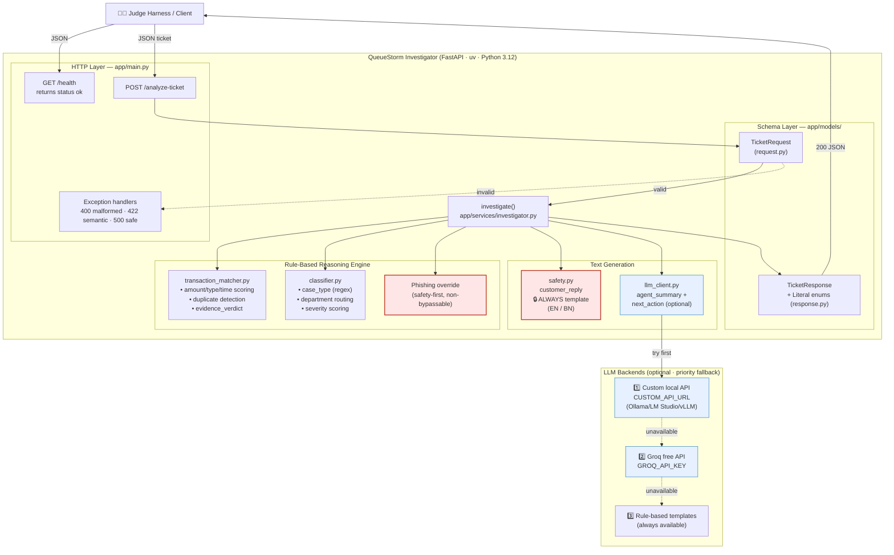
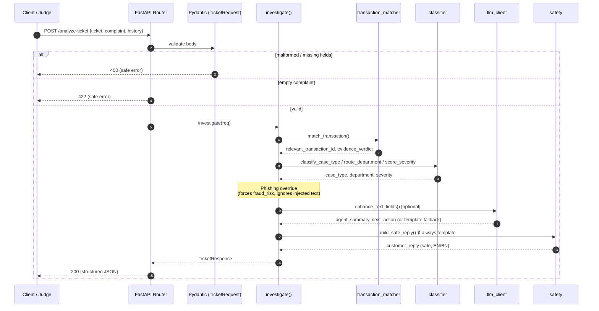
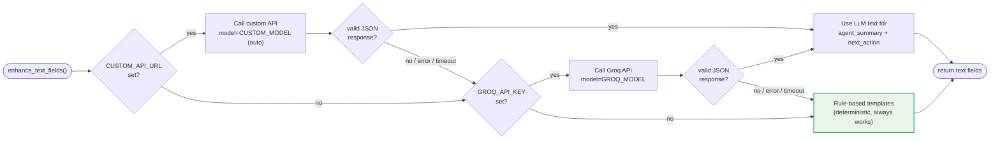

# QueueStorm Investigator — Architecture

## 1. System Overview

## 2. Request Processing Pipeline

## 3. LLM Fallback Decision Flow

## Design Principles

| Principle | How it shows up in the architecture |
|-----------|-------------------------------------|
| **Safety is non-negotiable** | `customer_reply` is **always** template-generated (`safety.py`), never from an LLM. Phishing detection overrides classification and cannot be bypassed by complaint text. |
| **Graceful degradation** | Three-tier LLM fallback ends in rule-based templates, so the service works fully offline with zero API keys. |
| **Evidence over text** | The complaint is investigated against `transaction_history` (`transaction_matcher.py`) — not just classified — producing `relevant_transaction_id` and `evidence_verdict`. |
| **Fail safe, never crash** | All malformed input returns controlled 400/422/500 with non-sensitive messages; no stack traces or secrets leak. |
| **Deterministic core** | The rule engine is pure/in-process: ~20ms p95, well under the 30s limit, and reproducible for automated judging. |
